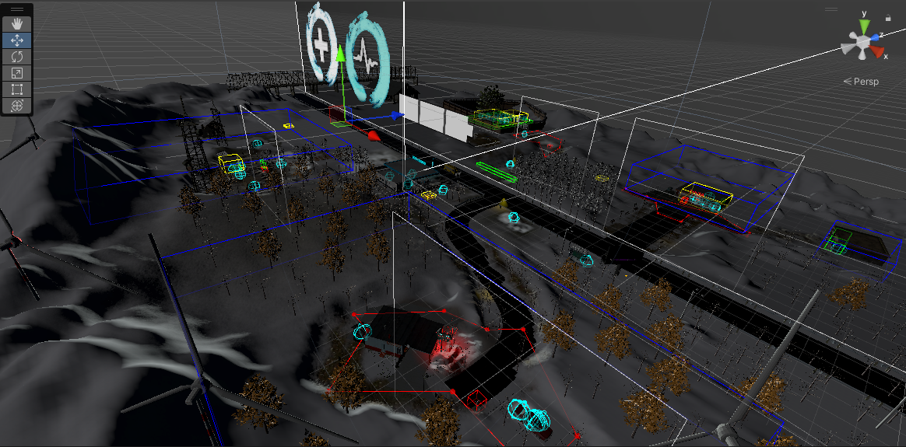
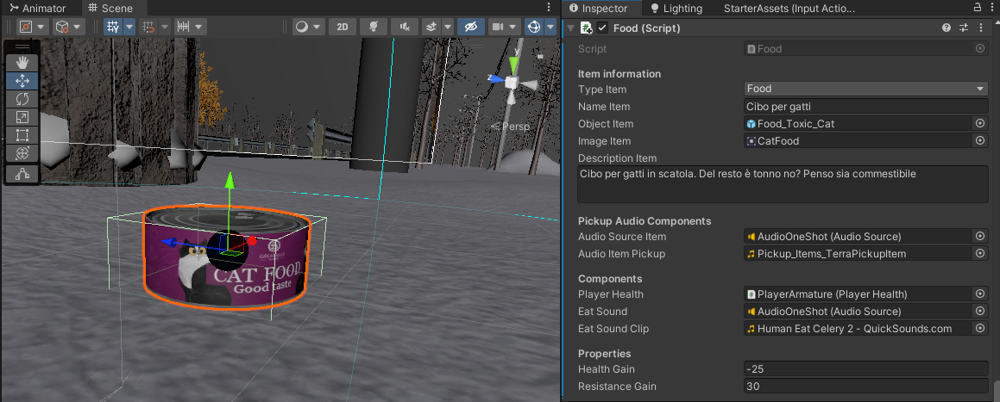
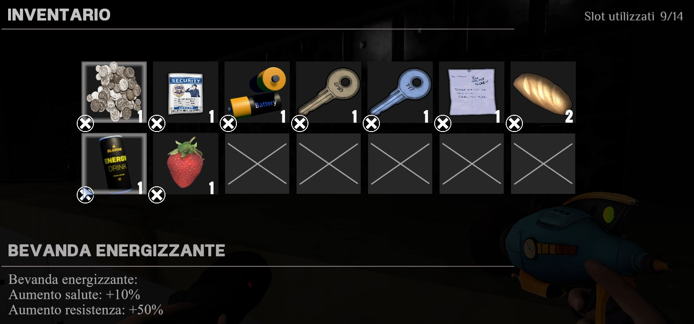
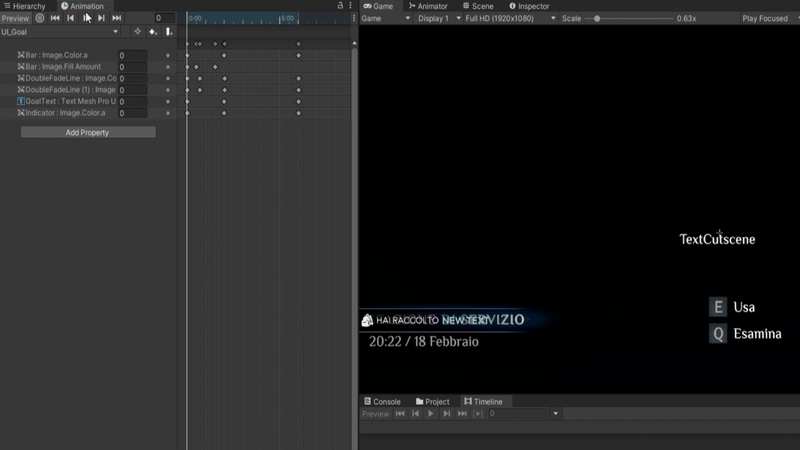
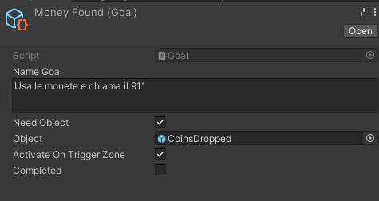

# ❄️ Don't Leave Me Alone ❄️

> **NOTA IMPORTANTE**: La cartella degli assets contiene solo gli scripts in quanto alcuni dei modelli/file e suoni utilizzati sono ora disponbili a pagamento (gratuiti al momento della creazione) o non dispongono delle licenze appropriate, evitando così situazioni di reverse-engineering e violazione del diritto di autore.

> **CREDITI**: Tutti i modelli utilizzati nel gioco, erano al momento della creazione gratuiti, e provenienti da SketchFab, Unity Assets Store e CGTrader.

## Introduzione
Don't Leave Me Alone è un gioco/progetto esclusivamente personale realizzato per un esame universitario *Sviluppo dei Videogiochi*, per [Università di Bari Aldo Moro](https://www.uniba.it/it/ricerca/dipartimenti/informatica), sostenuto nel settembre 2022. Il principale obiettivo del corso era quello di analizzare tutti gli aspetti che precedono la creazione di un gioco, da un punto di vista teorico, ed infine realizzare una demo giocabile utilizzando un motore grafico a scelta. Un altro aspetto importante è stato quello di dover realizzare il *Game Document Design* per comprendere quanto sia fondamentale nel processo di sviluppo di un videogioco.

> **NOTA IMPORTANTE**: si tratta di un progetto universitario ed esclusivamente personale senza alcun scopo commerciale. L'obiettivo era quello di dimostrare le capacità di programmazione, abilità creative e inventiva.

### Storia del gioco
Kevin è un ragazzino di una piccola cittadina che soffre di sindrome di abbando e attacchi di paino/ansia. La sua scuola sta organizzando un viaggio scolastico nel mese di Febbraio in un zona di montagna molto nevosa. La passione per la neve non ferma Kevin ad accettare di andarci e sua madre effettua una richiesta per un accompagnatore. Il viaggio parte molto bene fino a quando Kevin per suo errore, non viene dimenticato in una stazione di servizio. Egli dovrà sconfiggere le sue più grandi paure e trovare un modo per trovare i suoi amici e tornare a casa...

### Software utilizzati
Durante la fase di sviluppo sono stati utilizzati diversi software, tra cui:

- *Unity Engine 2021.3.0f1*: utilizzato come motore grafico per realizzare tale progetto, usando come linguaggio di programmazione C# (C Sharp) e *Visual Studio Community 2022* come IDE principale;
- *Blender*: utilizzato per modificare/eliminare alcuni parti dei modelli utilizzati;
- *Photoshop/GIMP*: utilizzati per la creazione di tutte le componenti grafiche del gioco, dalla realizzazione della UI, siano alle modifiche delle texture;
- *Sony Vegas / ShotCut*: utilizzati per la creazione/modifica di video, suoni e musica.

 

&nbsp; &nbsp; &nbsp; &nbsp;

> **NOTA:** la qualità delle GIF varia a seconda del tipo di compressione utilizzata

## Mappa
L'intera mappa del gioco è stata creata in piena autonomia al fine di mostrare capacità creative, piuttosto che utilizzare mappa già realizzate e pronte all'uso. La mappa è puramente intenzionale e non riflette in nessun modo luoghi/zone esistenti. La mappa è stata creata inizialmente come un piano piatto e successivamente modificata/deformata per ricreare ambienti tipici nevosi come la presenza di montagne e cumuli di neve. Di seguito una gif che mostra la mappa creata direttamente dall'editor di gioco:

<figure>

</figure>

Più dettagliatamente, sono stati utilizzati:
- *Terrain Tools*: per la creazione del terreno, istanziazione degli alberi/erba, per l'applicazione delle diverse textures;

- *Particle System*: sono stati utilizzati per ricreare la neve. Questo viene posizioanto al di sopra della telecamera principale in modo tale da simulare la caduta di neve in maniera più dinamica e simile alla realtà. Questo perché consente una maggiore regolazione ad esempio velocità e quantità delle particelle. La seguente immagine mostra come funziona: 
<figure>

</figure>

# Meccaniche di gioco

## Vita e resistenza
Il giocatore avrà a disposizione un certo livello di vita, 
massimo ad inizio livello con il quale interfacciarsi, che viene gestita dalla classe *PlayerHealth.cs*. Il giocatore sarà costantemente colpito dal freddo, che diminuirà lievemente la sua vita dopo un certo periodo di tempo, mediante il metodo *HitByCold()* e potrà subire danni in seguito al combattimento contro nemici, se entrato in Cold-Zone ed infine se passa attraverso o rimane al di sopra dei falò. La vita può essere aumentata rimanendo all'interno di Hot-Zone o cercando cibo/bevande.

Il giocatore potrà correre per un tempo limitato determinato dalla difficoltà impostata. La resistenza decrescerà quando il giocatore comincerà a correre e sarà ulteriormente diminuita in caso di salto. 
Una volta terminata, la resistenza comincerà a ricaricarsi secondo un fattore influenzato dalla difficoltà selezionata. La resistenza si ricaricherà più rapidamente 
quando il giocatore è fermo, meno rapidamente quando il giocatore cammina. La resistenza può essere aumentata mediante cibo e bevande.

Quando la vita del giocatore si azzera, verrà utilizzato il metodo della classe *DeathManager.cs* che segnalerà al giocatore di essere morto, dando la possibilità di rigiocare o andare nel menu principale.

## Esplorazione
Il giocatore potrà liberamente esplorare la mappa 
relativa al livello che si sta giocando. Tuttavia, sono previsti dei limitatori di mappa 
(non visibili) che non consentiranno al giocatore di oltrepassare una determinata 
zona.

### Cibo/Bevande, Batterie
Trovare il cibo è fondamentale per continuare l'avventura dal momento che la salute del giocatore verrà danneggiata da nemici, freddo e zone fredde (Cold-Zone). Ogni cibo/bevanda presenta diversi parametri come nome, descrizione, effetti sonori di quando vengono raccolti e mangiati/bevuti, ed infine il guadagno in termini di salute/resistenza, come viene mostrato di seguito:

<figure>

</figure>

Inoltre, dal momento che l'avventura ha luogo durante la notte, è altresì importante trovate le batterie per ricaricare la torcia (che sarà permanentemente equipaggiata). Per ognuna di essa, sarà possibile specificare, oltre le informazioni viste in precedenza, il guadagno che si ottiene da ciascuna batteria. Alcune batterie avranno un guadagno maggiore altre inferiore. Un esempio mostrato di seguito:

<figure>

</figure>

> Tutte queste classi ereditano dalla classe *StoreItem*  che specifica le informazioni sull'oggetto, tra cui nome, descrizione, immagine (visualizzata nell'inventario), e il tipo di oggetto. 

### Torcia e Monitor Temperatura
Il giocatore avrà a 
disposizione per l’intera avventura una torcia, gestita dalla classe *Torch.cs*. Una volta equipaggiata, il giocatore potrà accendere e spegnere la torcia. Si è definito un meccanismo di esaurimento e ricaricamento della torcia tramite il 
ritrovamento di batterie sparse nella mappa del livello. A 
seconda della difficoltà impostata, viene introdotto un 
meccanismo di ponderazione della durata della batteria.
La torcia sarà caratterizzata da un led, posto sulla parte laterale di essa, che assumerà un diverso colore a seconda dello stato della batteria. In particolare, 
quando accesa e con un’alta capienza il led assumerà colore verde. Quando spenta o scarica, il led assumerà colore rosso. A batteria terminata, la torcia si 
spegnerà automaticamente. Se il giocatore prova ad accendere la torcia, verrà emesso un picco lampo di 
luce. L'immagine di seguito, mostra i parametri della classe *Torch.cs* in cui è possibile specificare la minima e massima quantità della batteria, e ogni quanto tempo la batteria si scarica, ossia dopo quanto tempo deve essere eseguito il *drain* di essa. Inoltre, è anche possibile cambiare i colori dei led della batteria, nella sua capacità massima, media e minima, specifando il valore a partire dal quale entra in tale categoria.

<figure>

</figure>

Il monitor della temperatura si rende importante all’interno del gioco, in 
quanto segnalerà costantemente la temperatura corrente 
dell’ambiente. Il monitor della temperatura è 
caratterizzato da un led lampeggiante che può assumere 
tre colori distinti:

- Led ottimale (verde): è l’unico led non lampeggiante, segnala l’entrata in una Hot-Zone;

- Led medio (arancione/giallo): led lampeggiant indicante temperature sopra la 
soglia del minimo livello di sopportazione; in questo 
caso è comunque prevista, seppur minima, una riduzione della vita;

- Led pessimo (rosso): led lampeggiante accompagnato da un forte allarme acustico che segnala quando la temperatura comincia ad essere troppo 
bassa e quindi a danneggiare la vita del giocatore.

Il monitor della temperatura non prevede un meccanismo di ricarica delle batterie.

Di seguito una immagine raffigurante quanto riportato:

<figure>

</figure>

### Hot-Zone, Cold-Zone: 

Considerati i luoghi e ambienti 
nevosi, in ogni livello saranno presenti:

 - **Hot-Zone**: in specifiche zone della mappa del livello saranno previste delle 
aree calde all’interno delle quali il giocatore potrà ripristinare la propria vita.
A seconda della temperatura della Hot-Zone sino a quando il giocatore 
rimarrà all’interno di quest’area, la vita verrà ripristinata. Svolgono quindi un 
luogo di rifugio dal freddo congelante.
Metaforicamente l’ingresso in Hot-Zone simboleggiano l’accesso ad aree 
cerebrali che suscitano nella mente del protagonista sensazioni di sicurezza, 
e di non solitudine, che gli consentiranno di ritenersi al “sicuro” e quindi 
rigenerarsi mentalmente e praticamente recuperare la vita.

- **Cold-Zone**: in specifiche zone della mappa del livello saranno previste 
inoltre delle Cold-Zone. Queste al contrario delle Hot-Zone, saranno 
caratterizzate da temperatura più basse, che comporteranno la perdita 
della vita del giocatore, sino eventualmente a portarlo alla morte
Al contrario delle Hot-Zone, l’ingresso nelle Cold-Zone simboleggia l’accesso 
ad aree cerebrali che evocano pensieri distorti, contorti, di ansia e di paura 
che porteranno il protagonista a non ritenersi al sicuro e quindi a 
considerarsi in pericolo comportando così all’interno del gioco una riduzione 
della vita

La seguente gif mostra come il giocatore può utilizzare il monitor di temperatura per identificare zone calde (Hot-Zone) e zone fredde (Cold-Zone):

<figure>

</figure>

### Keypad e chiavi
I Keypad sono disposti in diverse zone della mappa. Il giocatore dovrà premere dei bottoni ciascuno corrispondente ad un numero per poter inserire il codice. Il display diventerà rosso, mostrando un codice di errore, quando l'utente digiterà e confermerà un codice errato. Quando il codice è corretto, questo aprirà una determinata porta/cancello/struttura. Ad ogni pressione del tasto verrà 
attivato il secondo led. Il terzo led verrà acceso quando il 
codice inserito sarà corretto con conseguente display verde 
che segnala il codice corretto. Il giocatore può anche decidere di cancellare tutte le cifre o una alla volta. Le classi che realizzano quanto descritto sono *Keypad* e *KeypadButton*.
 Di seguito viene mostrato un esempio:

<figure>

</figure>

Aggiuntivamente, il giocatore potrà trovare delle chiavi utili a scoprire maggiori informazioni sulla storia o indispensabili per poter continuare l'avventura. Quando un utente cerca di sbloccare una porta, verrà effettuato un controllo verificando che l'inventario contenga la corretta chiave. In caso positivo, la porta verrà sbloccata altrimenti verrà riprodotto un suono che simula, in base al tipo di porta, una forzatura di essa. L'immagine seguente, mostra un caso in cui il giocatore trova un chiave che permetta di aprire la porta di un'auto.

<figure>

</figure>

### Difficoltà

All’interno del gioco è previsto un meccanismo di difficoltà statica, che potrà essere scelto dal giocare ad inizio gioco. La difficoltà scelta influenzerà vari fattori, tra cui, la vita del giocatore che verrà costantemente diminuita per via del freddo. In particolare saranno influenzati:

- Resistenza: a seconda della difficoltà scelta, varieranno i tempi di recupero e di 
consumo della resistenza, in particolare varieranno le quantità di drop e restore 
della resistenza.
Il giocatore si stancherà di meno ma correrà meno velocemente a difficoltà 
facile; si stancherà più velocemente ma correrà più rapidamente a difficile;

- Combattimento: a seconda della difficoltà impostata il combattimento tra i 
vari nemici sarà influenzato da diversi fattori, tra cui il danno provocato dal 
nemico, il danno provocato dalla Thunder Gun e dall’urlo del protagonista, dalla 
vita dei nemici, dalla loro velocità e accelerazione. Inoltre, varierà anche la 
distanza da cui sarà possibile sparare per colpire i nemici. A difficoltà semplice, la 
distanza sarà minore poiché la velocità dei nemici sarà ridotta. A difficoltà media, 
aumenterà la velocità dei nemici, il danno da essi provocato e la distanza sarà 
maggiore. A difficoltà difficile, i nemici saranno molto veloci e la distanza da cui 
sparare sarà molto alta. La distanza invece per emettere l’urlo, sarà sempre la 
stessa;

 - Thunder Gun: in base alla difficoltà scelta cambierà il numero di colpi che sarà 
possibile sparare contemporaneamente. In particolare, per la difficoltà facile, 
media, difficile si avranno rispettivamente 3,6,10 colpi, questo poiché 
all’aumentare della difficoltà il numero di colpi necessari per l’uccisione dei nemici 
sarà maggiore. Varierà inoltre il range da cui sarà possibile colpire il nemico;

 - Torcia: a seconda della difficoltà, anche la durata delle batterie della torcia 
varieranno. A difficoltà semplice la durata della batteria sarà longeva, con tempi 
di scaricamento ridotti. A difficoltà media la durata sarà ridotta con tempi di 
scaricamento leggermente più veloci. A difficoltà difficile, la durata della batteria 
sarà estremamente ridotta con tempi di scaricamento più veloci, al fine di 
aumentare il livello di sfida.
 - Falò: il falò potrà recare danni sia al 
giocatore sia al nemico, quando ci si passa attraverso o si rimane su di esso.

All’aumentare della difficoltà, aumenterà anche il danno che sarà provocato al 
giocatore e al nemico.

## Inventario
Il giocatore avrà a disposizione un inventario all’interno del quale riporre oggetti per il proseguimento dell’avventura o che ritiene opportuno essere 
trasportati, per essere utilizzati successivamente in caso di necessità. Per gli oggetti per cui è prevista questa possibilità, avvicinandosi e premendo uno specifico tasto sarà possibile aggiungerli all’inventario.

<figure>

</figure>

Le seguenti GIF mostra un esempio di come il giocatore può raccogliere oggetti nell'inventario e rimuoverli se necessario. Nel primo caso vi è un cibo che viene mangiato, nel secondo viene aperta una nota. Un esempio è riportato di seguito:

<figure>

</figure>

L’inventario presenta un numero finito di “slot”, 
eventualmente estensibile utilizzando zaini più capienti, all’interno dei quali verranno memorizzati gli oggetti. Ogni slot sarà caratterizzato da una 
immagine rappresentante l’oggetto aggiunto. Inoltre è presente una sezione descrittiva dell’oggetto, riportandone nome e descrizione. In basso a sinistra dello schermo comparirà, ove necessario, un messaggio di controllo relativo all’utilizzo dell’oggetto. Per ottenere la descrizione di un oggetto è sufficiente spostare il cursore o muovendosi tra gli slot mediante gamepad. Per poter utilizzare un oggetto è sufficiente posizionarsi e  cliccare lo slot o utilizzare uno specifico comando mediante gamepad. Ogni oggetto all’interno dell’inventario può essere rimosso e aggiunto nuovamente se rilasciato. 
Il giocatore potrà aggiungere all’inventario le seguenti categorie di oggetti:
- note; 
- chiavi;
- batterie;
- cibo/bevanda.

Poiché alcuni di questi oggetti potrebbero ripetersi all’interno dello stesso livello o in livelli separati, in ogni slot verrà riportata la quantità relativa a 
quell’oggetto. Non è previsto un limite massimo di quantità per uno stesso oggetto, come ad esempio si può osservare nella figura sottostante, in cui per l'oggetto pane, viene riportata anche la relativa quantità:

<figure>

</figure>

## Sistema di ispezione
 *Sistema di ispezione 3D*:  il sistema in questione potrà essere utilizzato solo per gli oggetti previsti per tale ispezione. Il giocatore quindi potrà osservare più da vicino dei particolari oggetti, alcuni dei quali fungono da oggetti da circostanza, altri saranno invece utili per il proseguimento della avventura. Sarà possibile ruotare tali oggetti, effettuare degli zoom in avanti o indietro 
per poterli analizzare più dettagliatamente. Eventualmente tali oggetti potranno essere anche raccolti. 
 
 
<figure>

</figure>

*Sistema di ispezione note*:  durante l’avventura il giocatore potrà esaminare delle note, pagine, poster, sparsi nell’ambiente. L’esaminazione di tali note è 
necessaria per il proseguimento dell’avventura, in quanto queste prendono parte a meccanismi di puzzle solving. Quando avviato, verrà mostrato in una interfaccia utente in 2D l’immagine relativa alla nota e premendo uno 
specifico tasto sarà possibile esaminarla. L’esaminazione riporterà la descrizione della nota e/o pensieri del protagonista su questa.

<figure>

</figure>

Infine, vi è un altro sistema di ispezione che consiste semplicemente nel riportare una sequenza di frasi quando il giocatore esegue il comando esamina, in cui può rimanere fermo o con la possibilità di muoversi a seconda dell'importanza dell'oggetto esaminato, per ulteriori dettagli [ispezione descrittiva](#ispezione-con-descrizione).

## Nemici

Durante l'avventura il giocatore dovrà affrontare e combattare contro diversi nemici, utilizzando una particolare arma nota come *ThunderGun* (pistola spara fulmini) e un forte urlo dalla sua mano. In questo caso viene utilizzata la tecnica di Raycast per colpire i nemici entro una certa distanza. Nella demo realizzata, la *ThunderGun* presenta inoltre un sistema di ricarica che varia in base alla difficoltà selezionata.
A difficoltà semplice, la distanza sarà minore poiché la velocità dei nemici sarà ridotta. A difficoltà media, aumenterà la velocità dei nemici, il danno da essi provocato e la distanza sarà maggiore. A difficoltà difficile, i nemici saranno molto veloci e la distanza da cui sparare sarà molto alta. La distanza invece per emettere l’urlo, sarà sempre la stessa.

<figure>

</figure>

Come si osserva nella seguente immagine, i nemici seguono in maniera indefinita il percorso impostato, sino a quando non si accorgeranno del giocatore o fino a quando non sarà lui stesso a colpirli, sparandogli o urlandoci contro:

<figure>

</figure>

Ogni nemico presenta parametri diversi che vengono cambiati in base alla difficoltà selezionata. Ad esempio, scegliendo la massima difficoltà la velocità dei nemici sarà maggiore e la loro vita aumenterà, diventando così sempre più difficile poterli eliminare. Alcuni nemici inoltre, possiedono un percorso pre-impostato che dovranno seguire, come mostrato di seguito. La seguente immagine mostra la classe *Enemy* che contiene tutte le infomazioni su di loro. Per ogni nemico, si specificano informazioni quali vita, vita massima, velocità in base alla difficoltà. Inotre, vengono specificati i suoni di quando i nemici corrono e di quando eseguono un attacco:

<figure>

</figure>

## Sistema di combattimento

Il combattimento è di tipo melee (corpo a corpo con utilizzo di armi) e avrà inizio 
quando il giocatore si avvicina troppo al nemico oppure quando il giocatore 
decide di colpire per primo il nemico. Quando il combattimento è avviato, il nemico comincerà a seguire il giocatore, 
evitando degli ostacoli se presenti. Quando molto vicino al giocatore sferrerà un 
attacco il cui danno varierà a seconda della difficoltà impostata. 
Il combattimento non dovrà necessariamente concludersi con la morte del 
nemico, in quanto, se abbastanza veloce, il giocatore potrà scappare/nascondersi.
 Al termine del combattimento segnato dalla morte del nemico, verrà lasciato del tempo “per riposare” al giocatore nel quale non sarà 
colpito dal freddo per un certo periodo di tempo.

Ogni nemico avrà una barra orizzontale rappresentante la vita di questo. Ad ogni 
colpo o urlo sferrato, questa verrà diminuita a seconda del danno causato. Tale 
barra viene attivata solo quando il conflitto è cominciato.
Inoltre sussiste un meccanismo di arresa che terminerà il conflitto. 
Vi sono diverse condizioni che determinano il meccanismo di arresa:
 - Se, dall’ultimo attacco sferrato dal nemico, si supera un certo periodo di 
tempo, allora il conflitto verrà terminato;

- Se il nemico rimane bloccato a causa di un ostacolo non riuscendo a 
trovare il percorso predeterminato o ritornare nella sua posizione iniziale, 
verrà fermato, in attesa dell’avvicinamento del giocatore;

- Il giocatore comincia il conflitto, e senza farsi attaccare riesce ad 
allontanarsi sufficientemente dal nemico o nascondendosi in strutture.

Indipendetemente da queste condizioni, se il conflitto termina senza la morte del nemico questo ritornerà a seguire il proprio percorso (se ne ha uno).

Il comportamento della pistola viene gestito dalla classe *Gun.cs*, mentre l'urlo dalla classe *Scream.cs*, mentre il cambio dall'arma all'urlo e viceversa viene gestito mediante la classe *EquipItem.cs*.

<figure>

</figure>

## Sistema di obiettivi
Ogni livello si compone di un certo numero di obiettivi da 
compiere. Il giocatore sarà costantemente guidato dal sistema che specificherà qual è l’obiettivo da eseguire. Ad ogni nuovo obiettivo verrà mostrato uno specifico box che riporta l’obiettivo corrente. Il completamento dell’obiettivo è subordinato da una determina azione da eseguire o passaggio in una specifica zona che attiva il nuovo obiettivo. A obiettivo completato, ne verrà mostrato immediatamente il successivo. Il giocatore potrà rammentare qual è l’obiettivo corrente nel menu di pausa. Nella [sezione dettagli] è possibile consultare come avviene il cambiamento del goal.

<figure>

</figure>

## Comandi

Il gioco presenta compatibilità con mouse e tastiera, ed è anche possibile 
utilizzare un controller. Il giocatore potrà scegliere in qualsiasi momento, mediante 
un apposito menu, quale dispositivo utilizzare. Poiché non sono stati previsti 
controlli specifici a seconda del controller utilizzato, questo verrà interpretato 
come un semplice Gamepad. Il gamepad verrà rilevato automaticamente e il 
giocatore potrà, se rilevato, immediatamente utilizzarlo, scegliendo il layout di 
riferimento nei vari menu. Le azioni e il mapping di queste sono state realizzate 
utilizzando il nuovo sistema di input di Unity ossia **StarterAssetsInputs**, come mostrato di seguito:

<figure>

</figure>

La seguente immagine mostra come, una volta collegato un controller, sia possibile cambiarne il layout. Se durante il gioco il dispositivo viene disconnesso, viene automaticamente ripristinato il layout di mouse e tastiera.

<figure>

</figure>

# Dettagli tecnici

## Grafica e UI
Il gioco è stato realizzato utilizzando la  Universal-Render-Pipeline (URP) dal momento che molte texture e modelli era principalmente definiti per questa pipeline. L’interfaccia utente (UI) è stata prevalentemente sviluppata in 2D. La maggior parte degli elementi grafici della UI sono stati creati autonomamente mediante *Photoshop*, talvolta usando elementi gratuiti (Unity Asset Store), ed immagini reperibili facilmente online. In particolare, il menu principale, l'inventario, e il menu di pausa sono stati realizzati interamente in 2D. Tutte le animazioni della UI sono state interamente realizzate con le *Animations* di Unity.

Per creare un'atmosfera più cupa e che rispecchiasse l'atmosfera immaginata, si è utilizzata la componente Volume, che permette di modificare e aggiungere una serie di aspetti grafici. Per usufruire di tali aspetti è stato necessario abilitare il *Post-Processing* della sola telecamera principale, il che significa che tali aspetti vengono applicati su tutti gli oggetti con layer di default. Nel livello principale della demo si sono ad esempio utilizzate le seguenti le componenti:

<figure>

</figure>

## Raycast and Interaction
L'interazione con i vari oggetti e i nemici avviene utilizzando le tecniche di *Raycast*. Più in particolare, ad ogni frame di gioco, vengono emessi dei raggi che colpiranno i diversi *Collider* degli oggetti/nemici all'interno della mappa. Più precisamente questi raggi, vengono emessi dal centro dello schermo (ossia della telecamera) ove è presente il *Crosshair*. Questi raggi possono essere visti come dei raggi infrarossi che, tornando indietro, riporteranno di aver colpito qualcosa.

Ogni oggetto interagibile all'interno del gioco avrà il tag *InteractableObject*. Naturalmente, per far sì che questo funzioni, è necessario che sia attaccata una componente *Collider* (Mesh Collider se ha un mesh, Box Collider, Sphere Collider e così via...)

Dopo aver ricevuto il segnale di ritorno, se l'oggetto è interagibile, ossia implementa la classe *InteractObject* oppure è di tag *InteractableObject*, allora verranno mostrati i seguenti comandi sullo schermo:

- *Usa*: al comando usa non corrisponde una singola azione, ma è possibile definire tramite l’utilizzo degli *Unity Events* le azioni da compiere;

- *Esamina*: a sua funzione può variare a seconda dell’oggetto. Nel caso di oggetti esaminabili in 3D o di note, come mostrato in [Sistema di ispezione](#sistema-di-ispezione) verranno specificati i relativi sistemi, ma vi sono anche altri tipi di oggetti per i quali l’esaminazione corrisponde ad una semplice 
descrizione testuale.

Come mostrato dalla seguente immagine, ogni oggetto interagibile presente due eventi:
- *OnInteractEvent()*: specifica cosa succederà quando l'utente interagirà con l'oggetto. Nel caso riportato dalla immagine, verrà eseguito uno specifico script che estende la classe *InteractObject* per definire le azioni di uso ed esaminazione, anche se qualsiasi azione può essere specificata; 

- *OnExamineEvent()*: specifica cosa succederà quando l'utente esamina un oggetto. Nel caso riportato dall'immagine, verrà chiamato il metodo *OnLook()* che specifica la descrizione di quell'oggetto, ad esempio un semplice testo o anche l'inizio di una cutscene. L'immagine seguente mostra un caso in cui viene creato un nuovo script *PayphoneScript*, che estende la classe *InteractObject*, per definire con esattezza la sequenza di azioni da eseguire, passandola poi come azione da eseguire.

La variabile *ItemTypeInteraction* è un enumerativo che specifica, per ogni oggetto, se questo può essere usato o esaminato o entrambi, mentre la variabile *Interactable Once* specifica che con quell'oggetto è possibile interagire una sola volta.

## FPS 

### Personaggi e camera
Per animare il personaggio, si è utilizzato il template di base fornito da Unity (t) ossia il *ThirdPersonController*, il quale è stato inizialmente utilizzato e poi successivamente e opportunamente modificato per soddisfare le esigenze e idee del gioco. La scelta di utilizzarlo deriva dai vantaggi che si ha per via delle animazioni come quelle di idle, corsa, camminata, salto e così via al fine di rendere la vista in prima persona più realistica e dinamica. Dal moemento che i modelli in 3D delle braccia del personaggio sono posizionati all'interno del corpo del personaggio, queste si muoveranno simultaneamente con le animazioni di esso e la videocamera. Di seguito riportato il controller/animatore del personaggio:

<figure>

</figure>

A partire dal template, la videocamera principale è così costituita:
Starting from the template, the main camera is made up like this:
- *Main Camera*: la videocamera principale che si occupa del rendering di tutto gli oggetti all'interno della mappa a cui viene attaccata la componente per utilizzare il framework *CinemachineBrain*;

- *PlayerFollowCamera*:  è la videocamera virtuale che segue *CinemachineVirtualCamera* la telecamera *PlayerCameraRoot*;

- *PlayerCameraRoot*: è semplicemente un oggetto il cui *transform* è posizionato nel corpo del personaggio in cui tale che muovendosi con il personaggio, la videocamera virtuale lo punti e lo segua, spostandosi così con il personaggio;

La *CinemachineVirtualCamera* viene inoltre utilizzato quando il giocatore sta correndo per incrementare il *frequency gain* (rumore) per simulare la fatica del giocatore quando la resistena termina. 

Dal momento che videocamera principale renderizza tutti gli oggetti nel layer di default, i modelli delle braccia del personaggio non possono appartenere a tale layer, perché altrimenti si verificherebbe il fenomeno di *Clipping*, ossia questi passerebbero attraverso il muro. Un modo per evitare tali situazioni, potrebbe essere quello di utilizzare dei *collider*, ma questo non consentirebbe al giocatore ad esempio di avvicinarsi ad un certo oggetto o muro. Pertanto, la soluzione trovata è stata quella di utilizzare un'altra videocamera attiva (chiamata *WeaponCamera*) contemporanemente a quella principale che renderizza solo oggetti di uno specifico layer, chiamato *Weapon*. L'immagine seguente mostra la soluzione descritta, infatti nell'layer di default effettivamente i modelli attraversano gli oggetti (immagine destra), mentre la *WeaponCamera*, renderizza solo quegli oggetti in modo tale da evitare il *clipping* (immagine sinistra). 

<figure>

</figure>

### Animazioni
Al fine di realizzare un gioco in prima persona, l'idea è quella di utilizzare i modelli 3D delle braccia e animarle. Più dettagliatamente, le braccia seguono in maniera sincronizzata la videocamera principale, come descritto in precedenza, in base a come si muove il giocatore.
Tutte le animazioni sono state realizzate utilizzando la componente integrata di Unity ossia *Animations* e *Animator*. Di seguito, viene mostrato come tutti i modelli 3D si muovano con la camera con le diverse animazioni:

<figure>

</figure>

Come mostrato nella sezione di combattimento [sezione di combattimento](#sistema-di-combattimento), vi sono diverse animazioni per il combattimento. In particolare, vi sono due modelli di braccio destro, uno per la *ThunderGun* e l'altro rappresentante il braccio per eseguire l'urlo. Per il primo modello, sono state realizzate le animazioni per consentire l'equipaggio e non dell'arma, per mirare, per eseguire lo sparo durante la mira e non, mentre per il secondo modello sono state realizzate per riprodurre il movimento della mano e del braccio a simulare una onda d'urto. 

Quando l'utente sta sparando e preme il pulsante per eseguire l'urlo, viene eseguita l'animazione per il non equipaggiamento della pistola, e successivamente quella per equipaggiare il secondo braccio ed eseguire poi l'urlo. Al termine di tale aniamzione, verrà eseguito il processo inverso, per riportare ad equipaggiare nuovamente la pistola. Chiaramente, l'utente non potrà cambiare con la rotella del mouse o il pulsante del gamepad l'oggetto sul braccio destro fino a quando non saranno terminate tutte le animazioni, rendendo il cambio più realistico.

Vi è inoltre un altro modello di braccio destro in cui il personaggio mantiene il monitor della temperatura, ed anche per questo sono state definite le stesse animazioni del precedente. La seguente GIF mostra le animazioni di quanto descritto:
<figure>

</figure>

### Combattimento
Il combattimento può avere inizio quando il giocatore si avvicina troppo al nemico o sferra per primo un colpo o un grido. Per implementare il primo caso, si 
rende necessario che, sia il giocatore, sia il nemico abbiano attaccate le componenti *Collider* e *Rigibody*. Utilizzando la funzione *OnTriggerStay()* sulla classe 
*Enemy.cs* che avrà ogni nemico, quando il giocatore si avvicina entro una certa distanza, calcolando la distanza dal giocatore utilizzando *Vector3.Distance*, il 
nemico si accorge del giocatore e comincerà a seguirlo utilizzando la componente *NavMeshAgent*. Se, durante l’inseguimento incontrerà degli ostacoli, 
automaticamente il nemico cercherà il percorso migliore per ritornare a seguire il giocatore. Ogni elemento che costituisce un un ostacolo avrà la componente 
*NavMeshObstacle* oppure verrà identificato come *NotWalkable*.
Nel secondo caso, quando il giocatore colpisce con un grido avvicinandosi sufficientemente o sparando un fulmine al nemico, questo comincerà a seguirlo. Alcuni dei nemici, a livello iniziato o se non ancora uccisi, seguiranno un 
predeterminato percorso visibile all’interno dell’editor. Il percorso sarà costituito da 
più punti (Waypoints).

<figure>

</figure>

Dall'immagine soprastante si può osservere il percorso calcolato automaticamente dal *NavMeshAgent* rappresentato dal colore azzurro. Come si può notare, le barricate di legno non sono contrassegnate come *Walkable*, il che significa che il nemico non potrà attraversare tali oggetti. Quando questo accade il nemico calcolerà automaticamente il percorso per arrivare alla posizione del giocatore. 

Per la gestione del combattimento vengono utilizzate tre classi separate:

- *Enemy.cs:* si occupa di gestire tutti gli aspetti relativi al nemico tra cui impostare i diversi parametri come vita, danno e così via in base alla difficoltà impostata, di avviare l'inseguimento del giocatore (nel metodo *Update()*, quando la distanza da esso è inferiore ad una certa soglia. Quando il nemico comincia ad inseguire il giocatore, provvede a disabilitare il *Raycast*, in modo tale da non consentire alcuna interazione con altri oggetti, ferma l'eventuale percorso del nemico, mostra la barra di vita del nemico. Un altro particolare metodo di questa classe è la coroutine *GetStucked()* che viene avviata quando la posizione del nemico è uguale all'ultima posizione registrata. In questo caso il metodo controlla se, dopo un certo intervallo di tempo, il nemico sia rimasto bloccato in una stessa posizionte. In caso positivo smetterà di seguire il giocatore.
Infine, questa classe si occupa anche di gestire l'attacco da parte del nemico, eseguendo suoni specifici e bloccando il nemico quando sferra l'attacco, oltre che gestire anche i meccanismi di arresa con i metodi *GetStucked()* e *SurrenderAfterTime()*;

- *EnemyMovement.cs*: questa classe si occupa di gestire il movimento tra diversi *waypoints* del nemico, che stabiliscono il suo percorso. In particolare, mediante il metodo *Update()*  viene calcolata la distanza del nemico dal prossimo *waypoint*. Quando questa è inferiore alla *StopDistance* che indica quando il nemico deve cominciare a fermarsi, il nemico assumerà la posizione di idle e verrà invocato il *LookAround()* che consiste nel bloccare il nemico e dargli il tempo di "guardarsi attorno". Terminato questo tempo, si sposterà al successivo waypoint;

- *EnemyFollow.cs*: questa classe si occupa di gestire le situazioni che avviano uno scontro. Nello specifico, quando lo scontro ha inizio, ossia quando un nemico comincia a seguire il giocatore, si occuperà di avviare il suondo relativo al combattimento e di interromperla quando lo scontro termina. Quando il nemico attacca il giocatore, si occuperà inoltre di mostrare un'animazione che rappresenta il danno subito, utilizzare le coroutine *PlayerAttacked()*.

## Sistemi di ispezione

### Ispezione 3D
Per realizzare il sistema di ispezione 3D, si è reso necessario utilizzare una nuova telecamera chiamata *InspectingCamera* che renderizza solamente gli oggetti con il tag *InspectionObj*, come visto in precendenza. In particolare, questa telecamera viene inserita all'interno della telecamera principale in modo che si sposti in maniera sincronizzata con essa. Successivamente si utilizza un oggetto *Socket* che viene posizionato al centro della telecamera principale e poi spostato in avanti, in modo tale che la nuova telecamera possa renderizzare l'oggetto da vicino. Un esempio di funzionamento è riportato di sotto:

<figure>

</figure>

Come si può osservare dalla figura soprastante, quando il giocatore si avvicina all'oggetto e preme il pulsante esamina, esso assumerà la posizione del socket avvicinandosi così alla nuova telecamera, e il giocatore sarà libero di ruotarlo a piacimento. Se l'oggetto è singolo, allora verrà spostato sul layer *InspectionObj*, se invece è costituito da più parti allora anche tutti gli altri oggetti (*children*) verranno spostati a tale layer, in modo tale che non siano più visibili sul layer di default. Inoltre, come si osserva nella figura sottostante, poiché ogni modello di oggetto presenta delle dimensioni differenti, si è definito lo script *InteractiveItem* che stabilisce la massima e minima dimensione per cui può essere ingradito/ridotto, mentre le prime due variabili specificano se ridurre o aumentare la dimensione dell'oggetto come nel caso dell'immagine soprastante in cui la dimensione dell'oggetto viene aumentata quando assume la posizione del socket.

<figure>

</figure>

Quando il giocatore termina l'ispezione dell'oggetto, questo ritornerà nell'esatta posizione e dimensione in cui è stato raccolto, spostatando l'oggetto più gli eventuali oggetti *children* di esso nuovamente al layer di default, e la *InspectingCamera* verrà disabilitata. Per creare un effetto di riposizionamento, quando il giocatore termina l'ispezione, l'oggetto tornerà "lentamente" a rotearsi e riposizionarsi nella sua posizione iniziale. Durante questo periodo di tempo i comandi del giocatore saranno bloccati. Lo script che si occupa di tale processo è *InspectionManager*.

### Ispezione note
Per quanto riguarda il sistema di ispezione delle note, è stato definita una UI, che si apre nel momento in cui il giocatore preme il pulsante di esaminazione. Più nello specifico, ogni nota viene rappresentata mediante uno *Sprite*. La classe *Note* estende la classe *InteractObject* aggiungendo la descrizione di quando esamina la nota.

<figure>

</figure>

Ad esempio, la prima descrizione corrisponde ad una breve descrizione dell'oggetto che viene visualizzata all'interno dell'inventario, mentre la seconda corrisponde ad una descrizione più dettagliata di quando il giocatore esamina la nota, come si può osservare nella seguente immagine:

<figure>

</figure>

### Ispezione con descrizione
Un altro tipo di ispezione/esaminazione consiste mostrare una serie di frasi che descrivano un particolare oggetto. In questo intervallo di tempo il giocatore potrà essere bloccato o non. In particolare, nella classe *LookObject.cs* è definito un vettore di stringhe in cui è possibile specificare le frasi da mostare. Questo perché le frasi vengono riportate con uno stile da macchina da scrivere, dunque carattere per carattere, mediante lo script *TypeWriterUI.cs*. Inoltre, è presente la variabile booleana *Stop Player When Look* che se attivata non consentirà al giocatore di muoversi durante la descrizione, disabilitando anche lo script *Raycast* così da non poter eseguire alcuna interazione.

<figure>

</figure>

## Inventario

Per la gestione dell'inventario vengono utilizzate le classi *UI_InventorySystem.cs*, *UI_Slot.cs*, *StoreItem.cs*. Di seguito i dettagli: 

- *StoreItem.cs*: è la classe che si occupa di definire i dettagli di ogni item *storable* ossia che può essere raccolto all'interno dell'inventario. Ad ogni oggetto raccoglibile deve essere associato questo script;

- *UI_Slot.cs*: viene utilizzata per realizzare lo scheletro dello slot, nel quale vengono definiti i metodi per la rimozione degli elementi. Per la rimozione di un oggetto viene utilizzato il metodo *RemoveItem()*. In particolare, quando di un oggetto è presente una sola quantità, lo rimuoverà dall'inventario, facendolo cadere a terra se il giocatore decide di rimuoverlo mediante l'utilizzo di un *socket* (oggetto trasparente) che si muove contestualmente alla telecamera, altrimenti utilizzando nel modo opportuno l'oggetto se il giocatore ci clicca sopra. Ad esempio, se clicca su un cibo/bevanda verrà mangiato/bevuto invocando il metodo *DestroyItem()* che provedderà ad eliminare l'oggetto dall'ambiente di gioco, se clicca su una note viene aperto il sistema di ispezione di note e così via. Nella figura seguente si può osservare il primo slot selezionato vuoto. Il vettore *ItemStore* consente per l'appunto di memorizzare più volte lo stesso oggetto, mentre il *SocketDropItem* per far cadere l'oggetto davanti al giocatore;

<figure>

</figure>

- *UI_InventorySystem.cs*: è la classe principale che si occupa di gestire tutte le operazioni relative all'inventario, aggiunta di elementi, apertura e chiusura della relativa UI e così via. Per l'inserimento degli elementi viene utilizzato il metodo *AddItem()* che provvede ad rimuovere l'oggetto dall'ambiente di gioco (disabilitandolo), ed inserirlo (figuratamente) nell'inventario mediante una icona. Come citato in [inventario](#inventario), poiché vi sono più oggetti rappresentati lo stesso elemento come cibo e batterie, quando viene aggiunto nell'inventario il metodo controllerà che prima esista già in esso e, in caso positivo, provvederà a modificarne la quantità. Quando il giocatore raccoglie un oggetto e questo non è già presente all'interno di esso, il metodo provvederà a verificare se esiste uno slot disponibile a contenerlo. 
Quando il giocatore clicca su un elemento dell'inventario, questo verrà usato in modo differente utilizzando il metodo *UseSlot()* che provvederà a determinare il tipo di elemento (mediante casting) selezionato ed eseguire l'opportuna azione. Inoltre, è stato definito il metodo *SortItems()* che provvede ad eseguire un ordinamento degli elementi (usando l'algortimo *selection sort*) in modo tale da non lasciare slot vuoti. Tale metodo viene eseguito quando il giocatore rimuove o usa un elemento centrale (se la quantità è una).

Per realizzare le icone dell'inventario per ciascun oggetto 3D, si è creata una scena in cui vengono posizionati gli oggetti difronte alla telecamera ossia la classe *Screenshot.cs* e poi si esegue uno screenshot della schermata, specificando dall'editor il nome di esso. Le icone sono poi state successivamente modificate con *Photoshop*. Mentre per le note si è semplicemente utilizzato quest'ultimo. 

<figure>

</figure>

## Hot-Zone e Cold-Zone
Per realizzare le hot-zone e cold-zone sono state utilizzate rispettivamente *Hot-Zone.cs* e *Cold-Zone.cs*. Per rappresentare un'area di *Hot-Zone* viene utilizzato un oggetto vuoto a cui viene associato un *Box Collider* delle dimensione dell'area che si vuole rappresentare. Nella figura sottostante, l'area delimitata dalle linee gialle rappresenta una *Hot-Zone*, mentre l'area delimitata da linee blu rappresenta una Cold-Zone. Come si può notare dalla figura, esistono delle aree in cui all'interno di *Cold-Zone* vi sono anche *Hot-Zone*, anche se la maggior parte delle zone sono separate. 

<figure>

</figure>

La classe *Hot-Zone.cs* presenta le seguenti caretteristiche:

- *Temperature*: indica la temperatura della zona;
- *Health Gain*: indica la quantità di aumento della vita;
- *Time To Recover*: indica ogni quanto avverrà l'aumento di temperatura.

I falò sono piccole *Hot-Zone* che ripristineranno la vita meno velocemente.

Mentre per le Cold-Zone viene specificata la temperatura e *Health Drop* che rappresenta la quantità di vita da diminuire e anche in questo caso il *Time To Drop* che indica ogni quanto tempo il giocatore subirà tale diminuizione. L'immagine successiva mostra quanto detto.

Naturalmente, quando il giocatore entra all'interno di una *Hot-Zone* a sua volta all'interno di una Cold-Zone o viceversa, il sistema diminuirà o aumenterà a seconda dell'ultima zona entrata. Ad esempio, nel caso in cui entrasse in una *Hot-Zone* all'interno di una *Cold-Zone*, la vita verrà aumentata e non contemporaneamente diminuita, perché comunque il giocatore è ancora all'interno di una *Cold-Zone*. 

<figure>

</figure>

## Footstep System
Il gioco inoltre presenta un sistema che riproduce diversi suoni in base alla texture o oggetto su cui l'utente passa attraverso. Ad esempio, se l'utente sta camminando sulla neve questo riprodurrà,i vari suoni ad essa associati. Per fare questo, lo script  **FootstepSoundPlayer** controlla se il giocatore è a terra e su un terreno. Dopo questo, utilizzando le tecniche di Raycast, vengono emessi dei raggi che andranno a colpire il terreno, otterrà la texture albedo corrente ed eseguirà un *coroutine* selezionando un effetto sonoro in maniera casuale, relativo a tale texture.

Più precisamente, nello stesso script viene definita una classe privata *TextureSound* che specifica, per ogni texture, uno o più suoni. In questo modo, utilizzando un vettore di questa, sarà possibile associare ad ogni texture albedo diversi suoni, come mostrato di seguito:

<figure>

</figure>

Inoltre, per migliorare tale sistema e renderlo più realistico, questo riprodurrà il suono in maniera differente a seconda del contesto. Se il giocatore sta correndo allora per simulare il fatto che ci siano più step verranno riprodotti più suoni. Se il giocatore sta camminando, allora verranno riprodotti meno velocemente. Chiaramente, il sistema non riprodurrà nessun suono se il giocatore è fermo o in aria.

## Aggiornamento obiettivo
Come detto nella sezione, ogni goal potrà essere cambiato a seconda di determinate azioni eseguite dal giocatore. Più in particolare, la classe *Goal* è uno *ScriptableObject* che consente di specificare le caratteristiche dell'obiettivo. Come si osserva nella seconda immagine sottostante è possibile definire il nome dell'obiettivo, ossia quello che verrà mostrato in alto a sinistra, è possibile specificare se necessita di un oggetto e in tal caso passarlo, specificare se si attiva solo se il giocatore è all'interno di un'area specificata ed infine una variabile booleana che specifica se l'obiettivo è stato compleato.

Dopo aver definito, per ciascun livello, i diversi obiettivi, viene istanziato un oggetto a cui viene associato lo script *GoalManager* che presenta un vettore di obiettivi a cui andranno passati i goal definiti in precedenza. Questo può ossere osservato nelle seguenti figure:    

<figure>

</figure>

## Cutscenes
Le cutscene sono state realizzate utilizzando la componente integrata di Unity ossia *Timeline*, che consente la creazione e sequenza di contenuti cinematografici, permettendo di modificare la posizione, rotazione, dimensione, attivazione/disattivazione e così via dei vari oggetti, dando così un maggiore controllo diretto sulle animazione, eventi ed interazioni evitando di usare software esterni. Di seguito, si riporta un esempio di animazione:

<figure>

</figure>

Per consentire il cambiamento automatico delle scritte delle cutscene (mostrate al centro dello schermo), viene associato ad un oggeto la classe *DialogueChanger* nella quale è possibile specificare tutte le frasi che dovranno essere mostrate all'interno di essa. Definite le frasi, viene associata al medesimo oggetto anche la componente *Signal Receiver* che funge dai ricevitore dai segnali che è possibile emettere dalle *Timeline*. Inoltre, vengono definiti due metodi *FadeIn* e *FadeOut* che consentono di applicare una dissolvenza in entrata e uscita quando il testo viene mostrato.

<figure>

</figure>

Come mostrato nella figura soprastante, il *Signal Receiver* rimane in attesa della ricezione di un segnale, che viene emesso all'interno della Timeline utilizzando il *Signal Emitter*, che in questo caso corrisponde all'invocazione del metodo *NextDialogue()* della classe *DialogueChanger* che si occuperà di eseguire il cambio del testo.

<figure>

</figure>

Poiché all'interno della demo sono previste diverse cutscene, l'idea è stata quella di creare uno script manager che gestisse l'intero processo di apertura e chiusura della cutscene. La soluzione trovata, è stata quella di creare un oggetto padre per ogni cutscene, a cui viene associato tale script, ossia *CutsceneManager*. Come si può osservare dalla figura di sotto, vengono definiti due *UnityEvent*, uno per specificare tutti gli eventi che devono accadere prima che la cutscene venga avviata, mentre il secondo evento utilizzato per specificare tutti gli eventi che devono accadere al completamento della cutscene. Questo poiché si vuole poter eseguire delle specifiche azioni senza così la necessità di creare script per eseguirle singolarmente.
Per ogni cutscene è possibile se è possibile saltare la cutscene e, in tal caso, specificare il comando per farlo. 

Più in particolare, quando viene avviata, la cutscene invoca l'evento *BeforeCutsceneStarts()* ed esegue tutte le varie azioni specificate e successivamente disabilita il Raycast, le varie telecamere principali e la possibilità al giocare di potersi muovere, facendo poi partire la timeline specificata nell'apposita variaible. Quando la timeline finisce, verranno eseguite le operazioni opposte, potendo così iniziare a giocare.

Nelle *coroutine* che si occupano di aprire e chiudere la cutscene, vengono inoltre implementati dei meccanismi per creare una dissolvenza in entrata e in uscita, tipica delle cutscene. Nella figura seguente si può osservare quanto descritto:

<figure>

</figure>

## Sistema di suggerimenti
La classe *HintManager.cs* viene utilizzata per mostrare all'inizio dei livelli dei suggerimenti per il giocatore. Per ogni suggerimento viene creato un oggetto a cui è associata la classe *Hint.cs*, che consente di specificare
con ulteriori tre oggeti, il testo a sinistra, l'icona del comando, e la descrizione (testo a destra). 
Nell'immagine riportata di sotto, a sinistra si può notare l'utilizzo dell'oggetto descritto e il relativo script, e sulla destra lo script manager, che va associato ad un oggetto distinto, a cui si passano le diverse hint da mostrare, potento specificare il tempo per ciascun suggerimento prima di passare al successivo.

<figure>

</figure>

## Menu e State Machine
La classe StateMachine.cs rappresenta un modo per indicare lo stato attuale del gioco. Infatti, poiché nel gioco vi sono varie situazioni che si ripetono, come ad esempio il fatto che il giocatore quando sia in una cutscene non può avere alcun tipo di interazione, o che quando è in combattimento non può interagire con altri oggetti, ad esempio leggere una nota e così via, o quando il giocatore avvia una ispezione e tanto altro, sono stati definiti dei metodi che consentono di specificare in che tipo di situazione è il giocatore. Ad esempio, *InventoryMenuState()* o *PauseMenuState()* sono due stati differenti, poiché nel primo il gioco deve andare avanti, ma l'interazione del giocatore (quindi il relativo raycast) devono essere disabilitati, ma non anche il suono che invece deve essere disattivamente se il giocatore apre il menu di pausa.

I vari menu del gioco, con le relative animazioni, sono stati realizzati interamente in *Unity*. In particolare, il menu principale, come anche visto nelle GIF precedenti, viene gestito dalla classe *MenuManager.cs*. Almeno nella demo, si occupa di gestire tutti gli eventi di input del giocatore, di selezionare quando il giocatore clicca su gioca la difficoltà con una breve descrizione, ed infine di selezionare le impostazioni del gioco tra cui la qualità, risoluzione e se a schermo intero.

La classe *PauseMenuManager.cs* gestisce invece il menu di pausa del gioco. In particolare, quando il giocatore apre il menu di pausa avvengono diverse azioni, tra cui:

- il *Time.delta* del gioco viene impostato a zero, in modo tale da interrompere qualsiasi azione/movimento del gioco;   

- viene disabilitato il Raycast in modo tale da non consentire al giocatore di interagire con degli oggetti, infatti se il giocatore aprisse il menu ma ritrovandosi davanti ad un oggetto interagibile e cliccando il relativo tasto, verrebbe comunque effettuata l'azione;

- vengono disattivati tutti i suoni che si stavano riproducendo, tranne nel momento in cui il giocatore si trovi in un combattimento;

- vengono disattivati tutti i vari sistemi di ispezione, inventario;

- viene mostrato l'obiettivo corrente del gioco;

Di seguito si riporta la schermata del menu di pausa
<figure>

</figure>

### Passaggio di livello
Quando occorre spostarsi da una scena all'altra, viene utilizzata la classe *LoadingScreen.cs* che provvede a caricare la scena in maniera asincrona, mostrando in basso a destra una animazione di caricamento. Quando viene avviato questo processo, tutti i suoni saranno distrutti e verrà mostrata una immagine rappresentante il livello che si sta per giocare e il nome e la descrizione di tale livello, utilizzando la classe scriptable object *LevelScene.cs*. Terminato il caricamento della scene, il giocatore potrà premere qualsiasi tasto per cominciare il nuovo livello. Un esempio di funzionamento viene mostrato di seguito, viene mostrato di seguito:

<figure>

</figure>
